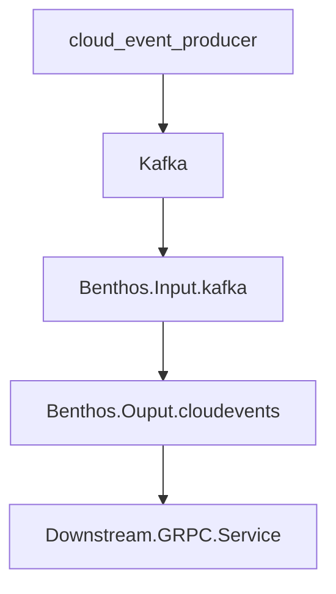

# benthos-cloudevents-fluffycore

A [Benthos](https://www.benthos.dev/) plugin that processes cloudevents and sends them downstream to a gprc handler.  

## CloudEvents

[CloudEvents Specification](https://github.com/cloudevents/spec/blob/v1.0.2/cloudevents/spec.md)  

## Pipeline



### CloudEvent

```json
{
    "id": "1234",
    "spec_version": "1.0",
    "type": "my.type",
    "source": "//my/source",
    "text_data": "{\"a\":\"b\"}",
    "attributes": [
        {
            "value": {
                "ce_string": "ORG1234abcd"
            },
            "key": "orgid"
        },
        {
            "value": {
                "ce_string": "ORG1234abcd"
            },
            "key": "partition-key"
        }
    ]
}
```
### CloudEvents in Kafka

| Kafka Part | data         |
| ---        | ---          |
| Key        | ORG1234abcd  |
| Headers    | <pre>{<br>  "ce_type":"my.type",<br>  "ce_orgid":"ORG1234abcd",<br>  "ce_source":"//my/source",<br>  "ce_specversion":"1.0","ce_time":"2023-11-11T14:57:14.594525315Z",<br>  "ce_id":"1234",<br>  "content-type":"application/json"<br>}</pre>|
| Value   | <pre>{<br>  "a":"b"<br>}</pre>|


### Benthos kafka batching

Each batch item must retain its headers and value in one json object.  I achieve this by doing a ```processors``` mapping which then gets packaged up as a binary array. ```[][]bytes```  

```yaml
http:
  enabled: false
input:
  kafka:
    addresses: ["${INPUT_KAFKA_BROKERS}"]
    topics: ["cloudevents-core"]
    consumer_group: "$Default2"
    multi_header: true
    batching:
      count: 3
      period: 60s
      processors:
        - json_schema:
            schema: '{"$schema":"http://json-schema.org/draft-04/schema#","type":"object","properties":{"id":{"type":"string"},"source":{"type":"string"},"specVersion":{"type":"string","enum":["1.0"]},"type":{"type":"string","enum":["requestunits.v1"]},"attributes":{"type":"object","properties":{"orgid":{"type":"object","properties":{"ceString":{"type":"string"}},"required":["ceString"]},"time":{"type":"object","properties":{"ceTimestamp":{"type":"string"}},"required":["ceTimestamp"]}},"required":["orgid","partition-key","time"]},"textData":{"type":"string"}},"required":["id","source","specVersion","type","attributes","textData"]}'
        - switch:
            - check: errored()
              processors:
                - for_each:
                    - while:
                        at_least_once: true
                        max_loops: 0
                        check: errored()
                        processors:
                          - catch: [] # Wipe any previous error
                          - mapping: "errorlogit(@,content())"
                - mapping: |
                    deleted()

        - archive:
            format: binary

pipeline:
  threads: 1
  processors:
    - sleep:
        duration: 1s

output:
  cloudevents_grpc:
    grpc_url: "${OUTPUT_CLOUDEVENTOUTPUT_GRPC_URL}"
    max_in_flight: 64
    channel: "mychannel"

    # auth[optional] one of: [oauth2,basic,apikey](ordered by priority)
    #--------------------------------------------------------------------
    #auth:
    #  basic:
    #    user_name: "admin"
    #    password: "password"
    #  oauth2:
    #    client_id: "my_client_id"
    #    client_secret: "secret"
    #    token_endpoint: "https://example.com/oauth2/token"
    #    scopes: ["scope1", "scope2"]
    #  apikey:
    #    name: "x-api-key"
    #    value: "secret"
logger:
  level: ${LOG_LEVEL}
  format: json
  add_timestamp: true
  static_fields:
    "@service": benthos.kafka
```

The custom output gets messages via benthos in the following json format

```json
[
    {
        "headers": {
            "ce_id": "1234",
            "ce_orgid": "ORG1234abcd",
            "ce_source": "//my/source",
            "ce_specversion": "1.0",
            "ce_time": "2023-11-11T14:57:14.594525315Z",
            "ce_type": "my.type",
            "content-type": "application/json",
            "kafka_key": "ORG1234abcd",
            "kafka_lag": 1,
            "kafka_offset": 0,
            "kafka_partition": 0,
            "kafka_timestamp_unix": 1699714634,
            "kafka_tombstone_message": false,
            "kafka_topic": "cloudevents-core"
        },
        "value": {
            "a": "b"
        }
    },
    {
        "headers": {
            "ce_id": "1234",
            "ce_orgid": "ORG1234abcd",
            "ce_source": "//my/source",
            "ce_specversion": "1.0",
            "ce_time": "2023-11-11T15:34:48.621943865Z",
            "ce_type": "my.type",
            "content-type": "application/json",
            "kafka_key": "ORG1234abcd",
            "kafka_lag": 0,
            "kafka_offset": 1,
            "kafka_partition": 0,
            "kafka_timestamp_unix": 1699716888,
            "kafka_tombstone_message": false,
            "kafka_topic": "cloudevents-core"
        },
        "value": {
            "a": "b"
        }
    }
]
```
## Downstream GRPC Handler

[cloudeventprocessor proto](./pkg/proto/cloudeventprocessor/cloudeventprocessor.proto)  

The ```cloudevents``` plugin processes and groups the messages into Good and Bad buckets and sends them both downstream.  It is an all of nothing acknowledgement from the downstream processor if the messages where handled.  Returning an error will result in the messages being sent again.  It is the responsiblity of the downstream processor to deal with bad data.  So putting bad data on a dead-letter queue is not something we will do here in benthos.

Your downstream processor can have 4 types of authentication.  ```None, OAuth2, ApiKey or basic auth.```

```yaml
output:
  cloudevents: 
    grpc_url: "localhost:9050"
    max_in_flight: 64

    # auth[optional] one of: [oauth2,basic,apikey](ordered by priority)
    #--------------------------------------------------------------------
    #auth:
    #  basic:
    #    user_name: "admin"
    #    password: "password"
    #  oauth2:
    #    client_id: "my_client_id"
    #    client_secret: "secret"
    #    token_endpoint: "https://example.com/oauth2/token"
    #    scopes: ["scope1", "scope2"]
    #  apikey:
    #    name: "x-api-key"
    #    value: "secret"
```

## Build the proto

[grpc.io](https://grpc.io/docs/languages/go/basics/)  
[Transcode Ref](https://grpc-ecosystem.github.io/grpc-gateway/docs/tutorials/introduction/)  
[custom protoc plugin](https://rotemtam.com/2021/03/22/creating-a-protoc-plugin-to-gen-go-code/)  

```bash
go install github.com/grpc-ecosystem/grpc-gateway/v2/protoc-gen-grpc-gateway@latest
go install github.com/grpc-ecosystem/grpc-gateway/v2/protoc-gen-openapiv2@latest
go install google.golang.org/protobuf/cmd/protoc-gen-go@latest
go install google.golang.org/grpc/cmd/protoc-gen-go-grpc@latest
go install github.com/fluffy-bunny/fluffycore/protoc-gen-go-fluffycore-di/cmd/protoc-gen-go-fluffycore-di@latest
```

```bash
protoc --go_out=. --go_opt=paths=source_relative ./pkg/proto/cloudevents/cloudevents.proto  

protoc --go_out=. --go_opt=paths=source_relative --go-grpc_out=. --go-grpc_opt=paths=source_relative --go-fluffycore-di_out=.  --go-fluffycore-di_opt=paths=source_relative ./pkg/proto/cloudeventprocessor/cloudeventprocessor.proto 

protoc --go_out=. --go_opt=paths=source_relative --go-grpc_out=. --go-grpc_opt=paths=source_relative --go-fluffycore-di_out=.  --go-fluffycore-di_opt=paths=source_relative ./pkg/proto/kafkacloudevent/kafkacloudevent.proto 

```

## Grpc References

[auth examples](https://github.com/johanbrandhorst/grpc-auth-example)  


## Docker

```bash
 docker build --file .\build\Dockerfile.processor . --tag fluffybunny.benthos.processor

 docker build --file .\build\Dockerfile.benthos . --tag fluffybunny.benthos.benthos

 docker-compose up
```

## Services

### Kafka UI

[Kafka-ui](http://localhost:9090/)  

### KafkaCloudEventService - grpc

```bash
grpc://localhost:9050
```

This is service to submit a cloud-event to kafka.  

#### Request

```json
{
    "batch": {
        "events": [
            {
                "attributes": [
                    {
                        "value": {
                            "ce_string": "ORG1234abcd"
                        },
                        "key": "orgid"
                    },
                    {
                        "value": {
                            "ce_string": "ORG1234abcd"
                        },
                        "key": "partition-key"
                    }
                ],
                "spec_version": "1.0",
                "text_data": "{\"a\":\"b\"}",
                "id": "1234",
                "type": "my.type",
                "source": "//my/source"
            }
        ]
    }
}
```

#### Response 

```json
{}
```

### CloudEventProcessor - grpc

```bash
grpc://localhost:9050
```

This service receives cloud-events as batches via out custom benthos output handler.

**IMPORTANT**: This is an all or nothing process.  It sends the messages in batches.  There are good and bad and the processor needs to decide what it wants to do with the bad messages.  In some cases the entire batch is bad at the 

### Viewer

I use docker desktop and look at the logs.  My downstream processor just logs what it got and returns a nil.  

## Benthos Notes

Validating Data in the input.
I want to write my custom output pluging to expect only perfect data.

```
input:
  kafka:
    addresses: ["kafka:9092"]
    topics: ["cloudevents-core"]
    consumer_group: "$Default"
    batching:
      count: 2
      period: 20s
      processors:
        - mapping: |
            root.value = this
            root.headers = @   
        - archive:
            format: json_array
```
I expect a json, and to make this resilient I put not-json into a kafka message.
I got the following errors from benthos(good)
``` 
level=error msg="failed assignment (line 1): unable to reference message as structured (with 'this'): message is empty" @service=benthos label="" path=root.input.batching.processors.0
level=error msg="Failed to create archive: failed to parse message as JSON: target message part does not exist" @service=benthos label="" path=root.input.batching.processors.1
```
I imagine that I could do something in the input.processors to validate an individual message.  
Upon NOT getting the headers and value I expect, I either eat it as handled or wrap it into a json that my output can now deal with and deadletter.   I think wrapping would be great.  If  root.value = this is bad, then turn it into {"crap":"encoded crap"}

That way I can still get an  json array, but can evaluate each item looking for crap.

On a side note I REALLY LIKE how y'all are handling errors.
So my batch setting is 3.
in kafka I have [crap]-[good]-[good]-[good]-[good]-[good]
When benthos sees this it eats the [crap] and then sends the next 2 [good] one at a time.  
I just need to code up that I may not get an array sometimes but may get the object instead.

I then start getting arrays of 3.  
NOICE!

eats the [crap]  => as a result of 
```
level=error msg="failed assignment (line 2): unable to reference message as structured (with 'this'): parse as json: invalid character 'a' looking for beginning of value" @service=benthos label="" path=root.input.batching.processors.0

```
